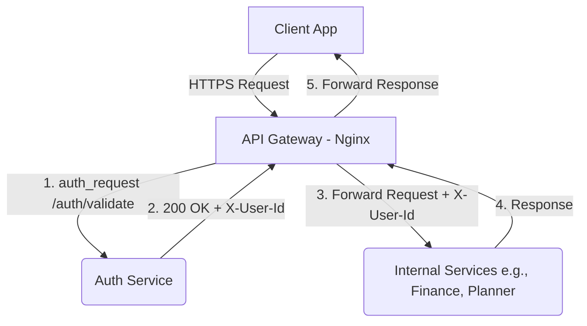

# API Gateway Design

## Overview
The API Gateway acts as the single entry point for all client requests entering the LifeOS ecosystem. It handles routing and delegates authentication to the Auth Service before forwarding requests to internal microservices.

## Objectives
- Centralized Routing
- Identity Propagation via JWT validation
- Enhanced System Security

## Architecture

## Implementation Details
We are using Nginx along with the `auth_request` module. For any protected route, Nginx will make a sub-request to the `/auth/validate` endpoint of the Auth Service. If the Auth Service returns `200 OK`, Nginx will forward the request to the target service. Otherwise, it will return `401 Unauthorized` directly to the client.
